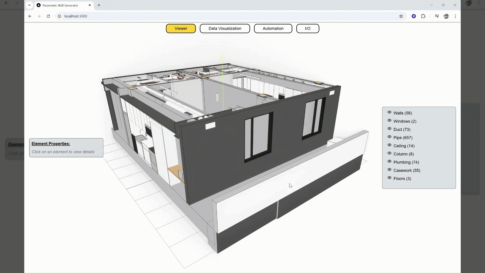

# Parametric Wall Generator



> **Prototype** — a proof-of-concept web app exploring parametric wall framing via Rhino Compute and interactive BIM visualization in the browser.

A full-stack prototype that connects a Rhino Compute backend to a Next.js frontend for real-time parametric wall generation and 3D visualization.

## What it does

- **Wall Automation** — configure wall parameters (window sizes, positions, stud gap) via sliders; the backend evaluates a Grasshopper definition via Rhino Compute and returns the computed wall mesh and studs in real time
- **3D Visualization** — interactive Three.js scene with orbit controls, edge overlays, and bloom post-processing
- **Data Visualization** — load a GLTF model, inspect element properties by clicking objects, toggle category visibility.

## Stack

| Layer | Tech |
|---|---|
| Frontend | Next.js 15 · React 19 · TypeScript · Tailwind CSS |
| 3D | Three.js · @react-three/fiber · @react-three/drei |
| Geometry | rhino3dm (JS) |
| Backend | ASP.NET Core 8 (Minimal API) |
| Compute | Rhino.Compute · Grasshopper (`automation.gh`) |

## Prerequisites

- [.NET 8 SDK](https://dotnet.microsoft.com/download)
- [Node.js 18+](https://nodejs.org)
- [Rhino 8](https://www.rhino3d.com/) with a valid licence (required by compute.geometry)
- [compute.geometry](https://github.com/mcneel/compute.rhino3d/tree/9.x/src/compute.geometry) — McNeel's self-hosted Grasshopper/Rhino compute server

## Architecture

```
Browser (Next.js)
    │  HTTP
    ▼
WallGenerator.Api  (ASP.NET Core 8, :5166)
    │  HTTP  calls GrasshopperCompute.EvaluateDefinition()
    ▼
compute.geometry   (Rhino Compute server, default :6500)
    │  executes automation.gh inside Rhino
    ▼
Grasshopper result (wall mesh + studs JSON)
```

The .NET API is a thin proxy: it receives wall parameters from the browser, forwards them to compute.geometry along with the Grasshopper definition (`automation.gh`), and streams the resulting geometry back as JSON.

## Getting started

### 1. Start compute.geometry

Clone and run the McNeel compute server — it must be running before the API:

```bash
git clone https://github.com/mcneel/compute.rhino3d.git
cd compute.rhino3d/src/compute.geometry
dotnet run
# compute.geometry running at http://localhost:6500
```

> Requires Rhino 8 installed and licensed on the same machine.

### 2. Start the API

```bash
cd Backend/src/WallGenerator.Api
dotnet run
# API available at http://localhost:5166
```

> **Port configuration:** The API connects to compute.geometry via the `WebAddress` property in `Backend/src/WallGenerator.Api/RhinoCompute.cs` (line 13). It defaults to `http://localhost:6500`. If your compute.geometry server runs on a different port, update that value to match before running the API.

### 3. Start the frontend

```bash
cd frontend
npm install
npm run dev
# App available at http://localhost:3000
```

## Project structure

```
/
├── Backend/
│   └── src/
│       └── WallGenerator.Api/
│           ├── Program.cs            # ASP.NET setup, CORS, /generate-wall endpoint
│           ├── RhinoCompute.cs       # Rhino Compute / Grasshopper evaluation wrapper
│           ├── DTOs/WallDto.cs       # Request payload
│           └── wwwroot/automation.gh # Grasshopper definition
└── frontend/
    ├── src/
    │   ├── app/                  # Next.js app router
    │   ├── components/three/     # Three.js scene and automation
    │   ├── components/ui/        # Panels, feature tabs, parameter inputs
    │   ├── context/              # Global app state provider
    │   └── core/                 # wall-automation-helper, three-helpers
    └── public/
        ├── models/test.gltf
```

## API

`POST /generate-wall`

Accepts a JSON body with wall dimensions, two window configurations, and stud gap. Returns wall mesh and stud arrays as serialized Rhino geometry.
